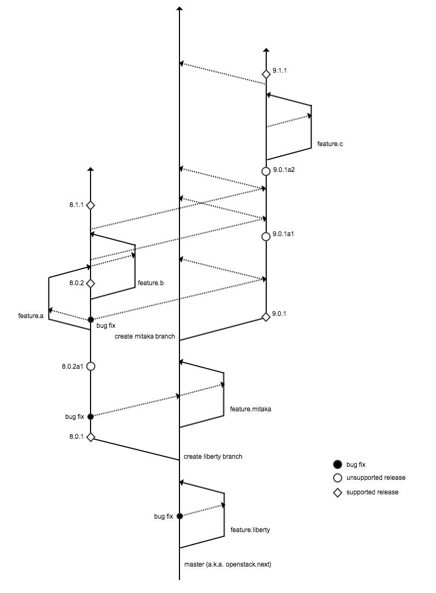

F5® Development Branching Strategy
==================================

.. important:: Development for all F5® OpenStack projects in GitHub follows this branching strategy.

Key Points
----------

* Development takes place on **feature branches**, which tend to follow the naming convention *feature.<featurename>*. These branches are either created from **master** or from the branch that corresponds to the earliest OpenStack version in which the bugfix/change needs to be made (e.g., ``liberty``).

* Feature branches are periodically merged into their 'parent' branches, most often in preparation for a release.

* Branches which correspond to specific OpenStack versions (e.g., ``kilo``, ``liberty``, ''mitaka``) are periodically merged up the chain to ensure commits which apply to multiple versions are included in each version's branch.

* ``master`` is the branch from which all development for new OpenStack versions is made.

.. topic:: Development Example

    #. ``feature.liberty`` is created from ``master``
    #. Development to support the liberty release is made on the ``feature.liberty`` branch.
    #. The ``feature.liberty`` branch is merged into ``master`` when all development for the liberty release is complete.
    #. The ``liberty`` branch is created from ``master``.

        - All liberty version releases (e.g., 8.0.1, 8.0.2, etc.) are created from the ``liberty`` branch.
        - All bugfixes for liberty + (e.g., fixes that need to be made for liberty releases and may also affect subsequent versions) are made on feature branches created from, and then merged back into, the ``liberty`` branch.
    #. ``master`` then moves 'ahead' of ``liberty`` in the branching structure; it is now the basis for all development for the mitaka release.

.. topic:: Bugfix Example

     #. A bugfix feature branch is created from ``liberty`` -- for example, ``bugfix#.liberty`` -- because that's the earliest OpenStack version in which the bug was identified.
     #. The ``bugfix#.liberty`` branch is merged into ``liberty`` when development is complete.
     #. ``liberty`` is merged up to ``mitaka``.
     #. ``mitaka`` is merged up to ``master``.
     #. When ``newton`` is created from ``master``, the bugfix is automatically included (no more bug!).

    Branching Strategy
